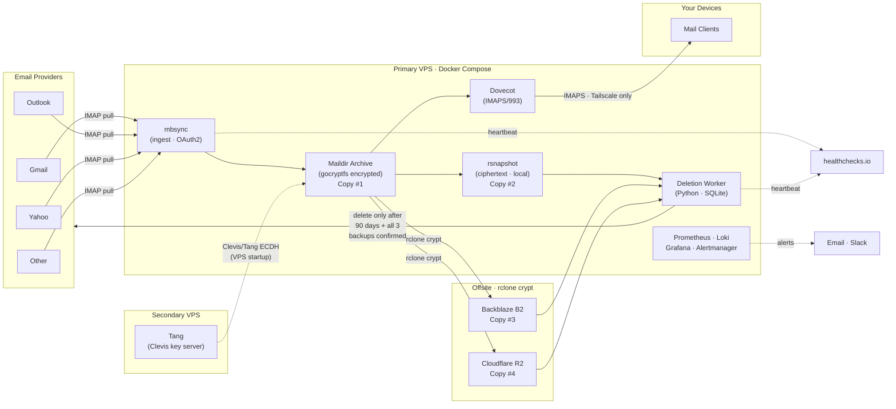

```mermaid
flowchart LR
    subgraph Providers[Email Providers]
        G[Gmail]
        O[Outlook]
        Y[Yahoo]
        X[Other]
    end

    subgraph VPS["Primary VPS · Docker Compose"]
        mbsync["mbsync\n(ingest · OAuth2)"]
        maildir["Maildir Archive\n(gocryptfs encrypted)\nCopy #1"]
        snap["rsnapshot\n(ciphertext · local)\nCopy #2"]
        worker["Deletion Worker\n(Python · SQLite)"]
        dovecot["Dovecot\n(IMAPS/993)"]
        obs["Prometheus · Loki\nGrafana · Alertmanager"]
    end

    subgraph Tang["Secondary VPS"]
        tang["Tang\n(Clevis key server)"]
    end

    subgraph Offsite["Offsite · rclone crypt"]
        B2["Backblaze B2\nCopy #3"]
        R2["Cloudflare R2\nCopy #4"]
    end

    subgraph Clients["Your Devices"]
        client["Mail Clients"]
    end

    G & O & Y & X -->|"IMAP pull"| mbsync
    mbsync --> maildir
    tang -. "Clevis/Tang ECDH\n(VPS startup)" .-> maildir
    maildir --> dovecot
    dovecot -->|"IMAPS · Tailscale only"| client
    maildir --> snap
    maildir -->|"rclone crypt"| B2 & R2
    snap & B2 & R2 --> worker
    worker -->|"delete only after\n90 days + all 3\nbackups confirmed"| Providers
    mbsync & worker -. "heartbeat" .-> hc["healthchecks.io"]
    obs -. "alerts" .-> notify["Email · Slack"]
```
