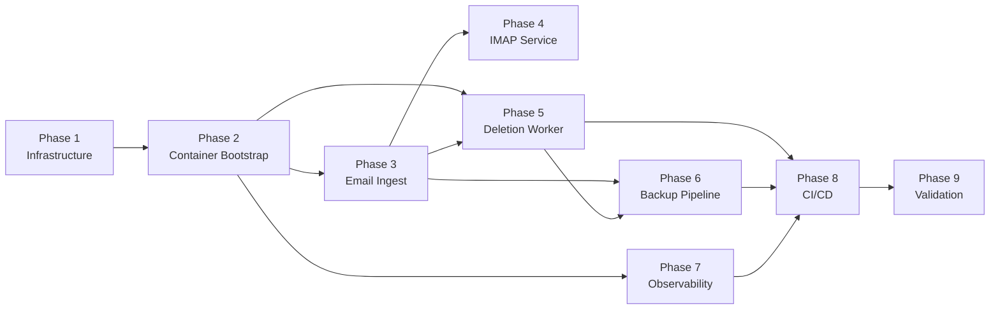

# mailarchiver — Implementation Plan

## Overview

| Phase | Delivers | Depends on |
|---|---|---|
| 1. Infrastructure | Two VPS nodes, Tailscale mesh, Tang, gocryptfs mounts, systemd unit | — |
| 2. Container bootstrap | Docker Compose skeleton, volumes, networks, secrets scaffolding | Phase 1 |
| 3. Email ingest | mbsync image, OAuth2/app-password auth, Ofelia schedule | Phase 2 |
| 4. IMAP service | Dovecot serving Maildir to mail clients over Tailscale | Phase 3 |
| 5. Deletion worker | SQLite schema, Python daemon, HALT logic, unit tests | Phases 2–3 |
| 6. Backup pipeline | rclone crypt to B2/R2, rsnapshot locally, backup_verifications | Phases 3, 5 |
| 7. Observability | Prometheus/Loki/Grafana stack, all alerts, healthchecks.io | Phase 2 |
| 8. CI/CD | GitHub Actions (CI + release/deploy), branch protection, Renovate | Phases 5–7 |
| 9. Validation | End-to-end tests, threat model review, DR drill | All phases |

---

## Phase Dependencies



Phases 3, 5, and 7 can all start once Phase 2 is complete. Phase 5 can begin as soon as ingest is producing Maildir output (early in Phase 3). Phase 6 requires both working ingest and the manifest DB schema from Phase 5.

---

## Implementation Conventions

### Test-Driven Development

All custom code (Python worker, OAuth2 helper script, any utility scripts) is written test-first:

1. Write a failing test that specifies the expected behavior
2. Implement the minimum code to make it pass
3. Refactor under passing tests

Tests live in `worker/tests/`. The CI `lint-and-test` job runs `pytest` — no code lands without a passing test suite. Phase 5 tasks cover the full worker test surface: HALT conditions, state transitions, eligibility logic, and metrics.

### Task Status

| Symbol | Meaning |
|---|---|
| `Pending` | Not started |
| `In Progress` | Actively being worked on |
| `Done` | Acceptance criterion met |

---

## Phase 1 — Infrastructure

**Prerequisites:** Two VPS instances provisioned (Ubuntu); Tailscale account.

| # | Task | Done when | Status |
|---|---|---|---|
| 1.1 | Tailscale mesh connects all three nodes (primary VPS, secondary VPS, local server) | `tailscale ping` succeeds between all three nodes | Pending |
| 1.2 | Tang server operational on secondary VPS and reachable from primary over Tailscale | `curl http://<tang-tailscale-ip>:7500/adv` returns a JOSE JWK response | Pending |
| 1.3 | gocryptfs volumes initialized on primary VPS with Clevis/Tang binding; fallback age passphrase escrowed in password manager | Both cipher directories exist; `clevis decrypt < tang-binding.jwe` succeeds; passphrase stored in password manager | Pending |
| 1.4 | `gocryptfs-mount.service` mounts both volumes automatically at boot (`Before=docker.service`) | After reboot: `mount \| grep gocryptfs` shows both mounts; `systemctl status gocryptfs-mount.service` shows active (exited) | Pending |
| 1.5 | VPS hardening baseline applied | Password SSH auth rejected; fail2ban active; unattended-upgrades enabled; deploy user in `docker` group only | Pending |

See `docs/architecture.md §7` for the full startup sequence and Tang fallback procedure.

---

## Phase 2 — Container Stack Bootstrap

**Prerequisites:** Phase 1 complete; Docker Engine + Compose v2 installed on primary VPS.

| # | Task | Done when | Status |
|---|---|---|---|
| 2.1 | Docker Compose file defines all services with correct network assignments (app-net / obs-net) and volume bindings (`maildir`, `manifest-db` bound to Phase 1 host paths) | `docker compose config` exits 0; container network assignments match `docs/tech-stack.md` | Pending |
| 2.2 | Tailscale sidecar container running and authenticated to tailnet | `docker compose ps tailscale` shows running; `docker exec tailscale tailscale status` shows connected | Pending |
| 2.3 | Docker secrets scaffolding in place: all required secrets documented, placeholder mechanism set up, no secrets committed to git | All secrets in `docs/tech-stack.md §Secrets` have a corresponding placeholder; `git status` shows no secret files | Pending |

See `docs/tech-stack.md` for the container layout, network segmentation diagram, and full secrets list.

---

## Phase 3 — Email Ingest

**Prerequisites:** Phase 2 complete; provider accounts and OAuth2 app credentials available.

| # | Task | Done when | Status |
|---|---|---|---|
| 3.1 | `mailarchiver-mbsync` Docker image builds with mbsync binary and OAuth2 XOAUTH2 helper script | `docker build` exits 0; `docker run --rm mailarchiver-mbsync mbsync --version` prints version | Pending |
| 3.2 | OAuth2 refresh token obtained and stored as Docker secret for each Gmail/Outlook account | mbsync OAuth2 helper returns a valid access token for each account | Pending |
| 3.3 | mbsync config syncs each account into its own Maildir namespace (Gmail: `[Gmail]/All Mail` only) | `Maildir/<account>/cur/` contains message files after `docker compose run --rm mbsync` | Pending |
| 3.4 | Ofelia scheduler running with 15-min ingest schedule and `no-overlap: true` on all jobs | `docker compose logs ofelia` shows jobs scheduled; a manually triggered concurrent run is skipped | Pending |

See `docs/architecture.md §5` for OAuth2 device flow details and `docs/tech-stack.md` for the Ofelia `no-overlap` requirement.

---

## Phase 4 — IMAP Service (Dovecot)

**Prerequisites:** Phase 3 complete (Maildir populated).

| # | Task | Done when | Status |
|---|---|---|---|
| 4.1 | Dovecot configured for Maildir storage with IMAPS/993 TLS using a Tailscale-issued certificate | `openssl s_client -connect <host>:993` shows a valid cert; plaintext port 143 refused | Pending |
| 4.2 | Dovecot authentication working with at least one mail user | Mail client (e.g., Thunderbird) authenticates successfully and can browse archived messages | Pending |
| 4.3 | Tailscale ACL restricts Dovecot port 993 to designated mail client devices only | Connection from a non-approved Tailscale device is refused; approved device connects | Pending |

See `docs/architecture.md §6` for Dovecot TLS, ACL, and authentication requirements.

---

## Phase 5 — Deletion Worker

**Prerequisites:** Phases 2–3 complete. All worker code written test-first (see TDD conventions).

| # | Task | Done when | Status |
|---|---|---|---|
| 5.1 | SQLite schema deployed with WAL mode enabled | All 4 tables exist; `PRAGMA journal_mode` returns `wal`; `PRAGMA integrity_check` returns `ok` | Pending |
| 5.2 | mbsync writes `messages` and `provider_copies` rows to manifest DB after each ingest run | `SELECT COUNT(*) FROM messages` increases after an mbsync run | Pending |
| 5.3 | Worker daemon implements full cycle logic: startup PENDING reset, eligibility query, per-account IMAP EXPUNGE, state transitions (PENDING → DELETED / ELIGIBLE + failure_count) | Worker starts without error; dry-run mode logs eligible candidates without deleting; cycle completes and worker sleeps | Pending |
| 5.4 | Worker exposes all four Prometheus metrics on `/metrics` endpoint | `curl worker:8000/metrics` returns `mailarchiver_worker_halt`, `worker_eligible_total`, `worker_deletions_total`, `backup_last_verified_timestamp_seconds` | Pending |
| 5.5 | All four HALT conditions covered by unit tests | `pytest tests/` passes; coverage includes DB integrity failure, DB inaccessible, all backups MISSING 3+ cycles, and 5 consecutive auth failures per account | Pending |
| 5.6 | Worker container image builds and starts as a long-running daemon | `docker compose up -d worker` succeeds; logs show cycle started; container stays running | Pending |

See `docs/architecture.md §2` for the full schema, worker algorithm pseudocode, and HALT condition table.

---

## Phase 6 — Backup Pipeline

**Prerequisites:** Phase 3 (Maildir populated); Phase 5 (manifest DB has `backup_verifications` schema).

| # | Task | Done when | Status |
|---|---|---|---|
| 6.1 | B2 and R2 buckets created with object versioning enabled and public access blocked | Versioning confirmed via cloud console; a deleted object is retained as a previous version | Pending |
| 6.2 | rclone crypt remotes configured for B2 and R2; passphrase escrowed in password manager | `rclone lsd b2-crypt:` and `rclone lsd r2-crypt:` succeed; passphrase recorded in password manager | Pending |
| 6.3 | rclone sync job transfers Maildir and manifest-db to B2 and R2 with successful check | `rclone check b2-crypt:maildir /var/lib/mailarchiver/maildir` exits 0 with no missing files | Pending |
| 6.4 | `backup_verifications` rows updated to CONFIRMED for B2 and R2 after each rclone check | SQL query shows CONFIRMED rows for both B2 and R2 destinations after a rclone run | Pending |
| 6.5 | rsnapshot pulling Maildir and manifest-db from primary VPS to local server over Tailscale | Snapshot directory on local server contains Maildir files; at least one prior snapshot is retained | Pending |
| 6.6 | `backup_verifications` LOCAL rows updated to CONFIRMED after each rsnapshot run | SQL query shows CONFIRMED row for LOCAL destination after a snapshot run | Pending |

See `docs/architecture.md §1` for rclone crypt configuration, B2/R2 object versioning requirements, and passphrase escrow.

---

## Phase 7 — Observability

**Prerequisites:** Phase 2 complete. Can be developed in parallel with Phases 3–6.

| # | Task | Done when | Status |
|---|---|---|---|
| 7.1 | All 7 observability containers start in Compose (Prometheus, Loki, Grafana, Alertmanager, Promtail, Pushgateway, node-exporter) | `docker compose ps` shows all 7 containers running; none restart-looping | Pending |
| 7.2 | Promtail ships container logs to Loki with correct labels | Grafana Explore → Loki query for `{container="worker"}` returns recent log lines | Pending |
| 7.3 | All 10 alert rules defined and validated | `promtool check rules config/prometheus/alerts.yml` exits 0; all alert names from `docs/observability.md` present | Pending |
| 7.4 | Alertmanager routing delivers test alert to both email (critical) and Slack/Discord (all severities) | `amtool check-config` exits 0; manually triggered test alert appears in Slack channel | Pending |
| 7.5 | Grafana secured: no anonymous access, admin password via Docker secret, not exposed on public VPS IP | Anonymous request to Grafana returns 401; Grafana port unreachable from outside Tailscale | Pending |
| 7.6 | healthchecks.io checks created and receiving heartbeats from worker and Ofelia | healthchecks.io dashboard shows both checks green after one full worker cycle and one mbsync run | Pending |

See `docs/observability.md` for the full alert mapping, routing rules, and access control requirements.

---

## Phase 8 — CI/CD

**Prerequisites:** Phases 5–7 complete (code to lint/test/build exists).

| # | Task | Done when | Status |
|---|---|---|---|
| 8.1 | CI workflow passes: lint-and-test (ruff, mypy, bandit, pytest), build-and-scan (docker build + trivy), validate-configs (compose, promtool, amtool, yaml) | GitHub Actions shows 3 green jobs on a push to main | Pending |
| 8.2 | Release workflow builds and pushes worker and mbsync images to ghcr.io on `v*` tag | `v0.1.0` tag → both images appear in ghcr.io with semver, SHA, and latest tags | Pending |
| 8.3 | Deploy job SSHs to VPS, runs `docker compose pull && up -d`, health-checks, and notifies webhook | Slack deploy notification received; `docker compose ps` on VPS shows all containers running | Pending |
| 8.4 | All Actions references pinned by commit SHA; all Compose image references pinned by digest | No `@v4`-style or `:latest` references in workflow files or docker-compose.yml | Pending |
| 8.5 | Branch protection configured on `main` and Renovate opens first dependency update PR | Direct push to main rejected; Renovate opens a PR for a stale image digest or Python dep | Pending |

See `docs/cicd.md` for pipeline design, security requirements, and rollback procedure.

---

## Phase 9 — Validation & Hardening

**Prerequisites:** All previous phases complete and running.

| # | Task | Done when | Status |
|---|---|---|---|
| 9.1 | End-to-end deletion verified: a message eligible by all three conditions is deleted from its provider account | `provider_copies.deletion_status = DELETED` and `deleted_at` set; message no longer visible in Gmail/Outlook | Pending |
| 9.2 | Tang failure resilience confirmed: Tang unreachable → primary VPS does not boot into Docker | After stopping Tang and rebooting primary VPS: `gocryptfs-mount.service` exits non-zero; `docker ps` shows no containers | Pending |
| 9.3 | Worker HALT confirmed: manifest DB corruption → worker halts and alert fires | After injecting DB corruption: worker logs `db_integrity_check_failed`; `worker_halt` gauge = 1; `ManifestIntegrityFailure` alert in Alertmanager | Pending |
| 9.4 | Backup gap blocks deletion: removing one B2 object → worker skips that message's deletion | After deleting one B2 object: next worker cycle leaves that message's `deletion_status = ELIGIBLE`; `BackupMissingFiles` alert fires | Pending |
| 9.5 | Disaster recovery drill succeeds on a clean test VPS following `docs/recovery.md` | Mail client can read archived messages on the recovered VPS; recovery completed within documented RTO | Pending |
| 9.6 | Threat model statuses updated to reflect implemented state | All 14 entries in `docs/threat-model.md` show "Implemented" or an accurately scoped status | Pending |

---

## Repo Structure at Completion

```
mailarchiver/
├── docker-compose.yml
├── .github/
│   └── workflows/
│       ├── ci.yml
│       └── release.yml
├── worker/
│   ├── Dockerfile
│   ├── main.py
│   ├── db.py            (schema + queries)
│   ├── imap.py          (IMAP session handler)
│   ├── metrics.py       (Prometheus endpoint)
│   └── tests/
├── mbsync/
│   ├── Dockerfile
│   ├── mbsyncrc         (template; real config from Docker secret)
│   └── oauth2-helper.sh
├── config/
│   ├── prometheus/
│   │   ├── prometheus.yml
│   │   └── alerts.yml
│   ├── alertmanager/
│   │   └── alertmanager.yml
│   ├── loki/
│   ├── promtail/
│   ├── grafana/
│   └── ofelia.ini
├── systemd/
│   └── gocryptfs-mount.service
└── docs/
```
