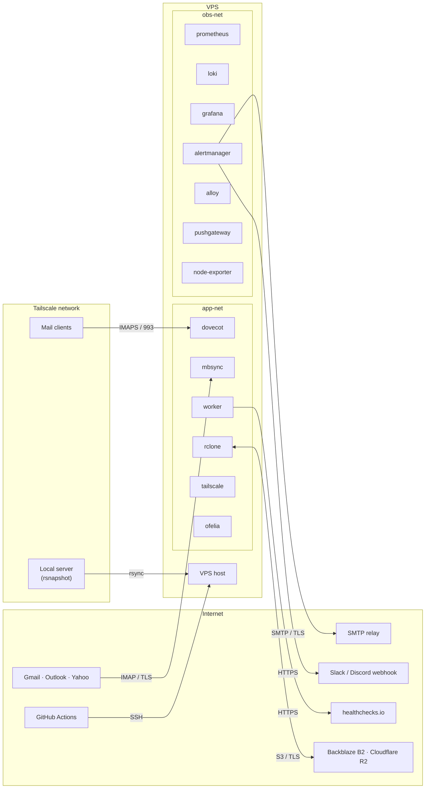

# mailarchiver — Threat Model

## Assets

Ranked by impact of loss or compromise:

| Asset | Impact of compromise |
|---|---|
| **Email content** (Maildir, backups) | Irreversible data loss or exposure of all personal correspondence |
| **rclone crypt passphrase** | B2 and R2 backups permanently unrecoverable |
| **OAuth2 refresh tokens** | Attacker gains full read/write/delete access to provider accounts |
| **Deletion worker integrity** | Worker subverted into deleting provider copies before backup confirmed → permanent loss |
| **Manifest DB** | Loss of deletion tracking state; recovery requires full Maildir rescan |
| **System availability** | Ingest stops; email accumulates on provider indefinitely |

---

## Threat Actors

| Actor | Capability | Primary motivation |
|---|---|---|
| Remote attacker | Network-level access, vulnerability exploitation | Email exfiltration, credential theft |
| Compromised dependency | Malicious code in Docker image or Python package | Exfiltration, persistence, pivoting |
| Compromised CI/CD | Control over deployment pipeline | VPS access, malicious image deployment |
| Cloud storage provider | Read access to stored objects | Surveillance (mitigated by rclone crypt) |
| Physical attacker | Access to local backup server hardware | Unencrypted Maildir exposure |
| Misconfiguration / self | Accidental operator action | Data loss, credential exposure |

---

## Trust Boundaries



---

## Threats and Mitigations

### T1 — VPS Compromise (SSH / Vulnerability Exploitation)

**Impact:** Full access to unencrypted Maildir, all Docker secrets, deletion worker manipulation.

**Vectors:** SSH brute force; exploitation of a running service; compromised deploy key.

| Mitigation | Severity | Status |
|---|---|---|
| Disable SSH password authentication; key-only | Critical | Not yet defined |
| SSH on non-standard port or port-knock; fail2ban | High | Not yet defined |
| Deploy SSH user is least-privilege (docker group only, no sudo) | High | Defined in cicd.md |
| Minimize public attack surface: only Dovecot exposed, and only to Tailscale | High | Defined in architecture.md |
| Unattended security upgrades on VPS OS | High | Not yet defined |
| Regular rotation of deploy SSH key (`VPS_SSH_KEY`) | Medium | Not yet defined |

---

### T2 — Maildir at Rest

**Impact:** All email readable if VPS disk is imaged (cloud provider breach, physical disk access, snapshot leak).

**Decision:** gocryptfs on the Maildir and manifest DB directories, passphrase derived at startup via Clevis + Tang on a secondary VPS over Tailscale. See `architecture.md §7`.

| Mitigation | Severity | Status |
|---|---|---|
| gocryptfs AES-256-GCM on `/maildir` and `/manifest-db` — ciphertext at rest, decrypted only while VPS is running | High | **Defined in architecture.md §7** |
| Tang server on secondary VPS — passphrase derived via JOSE ECDH; never stored on primary disk; never transmitted in plaintext | High | **Defined in architecture.md §7** |
| Per-file random IVs in gocryptfs — file-level isolation; compromise of one file's ciphertext does not expose key material for others | Medium | Inherent to gocryptfs |
| File name encryption enabled — leaks no folder/account structure at filesystem level | Medium | **Defined in architecture.md §7** |
| Fallback binding: age-encrypted passphrase escrowed in password manager (manual mount if Tang unreachable) | Medium | **Defined in architecture.md §7** |
| Local rsnapshot copy: gocryptfs on backup server with separate Tang binding and fallback escrow | Medium | Defined in docs/architecture.md §Local rsnapshot backup |

**Residual risk:** A live VPS compromise (attacker has shell) still has access to the mounted plaintext. gocryptfs is a disk-image threat mitigator, not a live-compromise mitigator. VPS hardening (T1) remains the primary defense against live access.

**Note:** B2 and R2 copies are independently encrypted by rclone crypt. The local rsnapshot copy is addressed separately in T9.

---

### T3 — OAuth2 Token Theft

**Impact:** Attacker reads, deletes, or exfiltrates email directly from provider accounts.

**Vectors:** VPS compromise → Docker secrets; accidental token logging; mbsync debug output.

| Mitigation | Severity | Status |
|---|---|---|
| OAuth2 scopes minimized: request only what is needed (see T4) | High | Needs review — see T4 |
| Tokens stored as Docker secrets (tmpfs, never written to disk) | High | Defined in architecture.md |
| Never log OAuth2 tokens or Authorization headers | High | Implementation requirement |
| Documented token revocation procedure (per provider) | Medium | Not yet defined |
| Periodic OAuth2 token rotation (re-authorize on a schedule) | Medium | Not yet defined |

---

### T4 — OAuth2 Scope Excess

**Impact:** If tokens are stolen, attacker has broader account access than needed.

**Current design:** Gmail scope documented as `https://mail.google.com/` (full IMAP access, including delete). This is required for the deletion worker to delete provider copies.

| Mitigation | Severity | Status |
|---|---|---|
| For **ingest-only** accounts (where deletion from provider is disabled or deferred): request read-only IMAP scope | Medium | Not yet defined |
| For **deletion-enabled** accounts: full IMAP scope is unavoidable; compensate with token rotation and VPS hardening | — | Accept |
| Outlook scope: `IMAP.AccessAsUser.All` is correct minimal scope for both read and delete | Low | Defined in architecture.md |

---

### T5 — Supply Chain: Docker Image Compromise

**Impact:** Malicious code running on VPS with access to shared volumes (Maildir, manifest DB) and Docker internal network.

**Vectors:** Compromised off-the-shelf image on Docker Hub; mutable tag (`latest`) hijacked; typosquatting.

| Mitigation | Severity | Status |
|---|---|---|
| **Pin all off-the-shelf images by digest** (`image@sha256:...`), not by tag | Critical | Defined in docs/tech-stack.md §Image digest pinning |
| **Trivy scan off-the-shelf images** in CI alongside custom images | High | Defined in docs/cicd.md §build-and-scan |
| Use Renovate/Dependabot to track digest updates (opens PR when upstream digest changes) | High | Defined in cicd.md — extend to digest pinning |
| Prefer images from official namespaces (e.g. `prom/prometheus`, `grafana/grafana`) over community variants | Medium | Implementation guidance |
| Docker Content Trust / Cosign signature verification for custom images | Medium | Not yet defined |

---

### T6 — Supply Chain: GitHub Actions Compromise

**Impact:** CI workflow runs malicious code with `VPS_SSH_KEY` in scope → persistent VPS access.

**Vectors:** Third-party action compromised (`actions/checkout@v4` tag moved); maintainer account compromised; malicious PR modifying workflow files.

| Mitigation | Severity | Status |
|---|---|---|
| **Pin all GitHub Actions to commit SHA**, not tag (`actions/checkout@11bd71901bbe5b1630ceea73d27597364c9af683` not `@v4`) | Critical | Defined in docs/cicd.md §Pipeline Security Requirements |
| Protect `main` branch: require PR + CI pass; no direct push | High | Defined in docs/cicd.md §Branch protection on main |
| Require PR review before merge to main | High | Defined in docs/cicd.md §Branch protection on main |
| Workflow permissions: set `permissions: read-all` at top level; grant write only where needed | High | Defined in docs/cicd.md §Workflow permissions |
| `VPS_SSH_KEY` scoped to least-privilege deploy user (docker only, no sudo) | High | Defined in cicd.md |
| Audit third-party actions; prefer official GitHub actions or well-audited equivalents | Medium | Not yet defined |

---

### T7 — Tailscale ACL / Rogue Peer

**Impact:** Any Tailscale peer can reach Dovecot IMAP, Grafana, or backup-management paths unless the tailnet policy restricts them by role.

**Vectors:** Tailscale account compromise; rogue device added to tailnet; Tailscale service compromise.

| Mitigation | Severity | Status |
|---|---|---|
| **Define Tailscale ACL matrix**: `tag:mail-client -> tag:primary-vps:993`, `tag:admin-device -> tag:primary-vps:3000`, `tag:backup-server -> tag:primary-vps:SSH_PORT`, `tag:admin-device -> tag:backup-server:SSH_PORT`; deny other Tailscale service access by default | High | Defined in docs/architecture.md §Tailscale ACL matrix |
| Enable Tailscale device approval: new devices require explicit admin approval before joining tailnet | High | Not yet defined |
| Enable Tailscale MFA on the tailnet admin account | High | Not yet defined |
| Dovecot authentication provides a second layer of access control for IMAP access even for authorized Tailscale peers | Medium | Defined in docs/architecture.md §Dovecot network exposure |
| Monitor Tailscale admin console for unexpected nodes | Low | Not yet defined |

---

### T8 — Cloud Storage Provider Breach (B2 / R2)

**Impact:** Provider reads stored backup data.

**Current design:** rclone crypt encrypts all data before it leaves the VPS. File names and content are opaque to the provider.

| Mitigation | Severity | Status |
|---|---|---|
| rclone crypt AES-256-CTR already in design | — | Defined in architecture.md |
| **B2/R2 API keys scoped to the specific backup bucket only** (not account-level) — limits blast radius if API key is leaked | High | Defined in docs/architecture.md §1 |
| Enable bucket-level access policies: block public access, no pre-signed URL generation | High | Not yet defined |
| Enable object versioning (already required for accidental deletion protection — see resilience doc) | High | Defined in architecture.md |
| Consider B2/R2 Object Lock (WORM) for additional tamper protection | Low | Not yet defined |

---

### T9 — Local Backup Exposure

**Impact:** Physical access to the backup server's disk, or shell access while the local snapshot target is mounted, can expose the local backup copy.

**Current design:** B2 and R2 are encrypted by rclone crypt. The local rsnapshot copy is also encrypted at rest on the backup server: rsnapshot writes only into a job-scoped gocryptfs plaintext target backed by a local ciphertext directory and unlocked via Clevis/Tang.

| Mitigation | Severity | Status |
|---|---|---|
| gocryptfs on the local rsnapshot target, unlocked via Clevis/Tang, with separate age-encrypted fallback escrow | High | Defined in docs/architecture.md §Local rsnapshot backup |
| rsnapshot directory: readable only by the rsnapshot user (filesystem permissions) | Medium | Not yet defined |
| Access to local server itself only via Tailscale (same ACL controls as VPS access) | Medium | Not yet defined |
| Accept residual risk: local snapshot plaintext is accessible while the job-scoped target is mounted | — | Documented residual risk after T9 controls |

---

### T10 — Docker Network (Flat Internal Network)

**Impact:** A compromised observability container (Prometheus, Grafana, Loki, etc.) has network access to the worker, Pushgateway, and can scrape Maildir-related metrics. A compromised container could push false metrics to suppress alerts.

**Current design:** Single flat Docker Compose network — all containers can reach each other.

| Mitigation | Severity | Status |
|---|---|---|
| **Define two Docker networks**: `app-net` (application containers) and `obs-net` (observability containers) | High | Defined in docs/tech-stack.md §Docker network segmentation |
| Worker attached to both networks (exposes `/metrics` to `obs-net`; accesses Maildir on `app-net`) | High | Defined in docs/tech-stack.md §Docker network segmentation |
| Pushgateway bridges both networks — mbsync and rclone push to it on `app-net`; Prometheus scrapes it from `obs-net` | Medium | Defined in docs/tech-stack.md §Docker network segmentation |
| Alloy must not mount `/var/run/docker.sock` directly; only a socket proxy may bind the Docker socket | Medium | Defined in docs/tech-stack.md §Docker socket proxy |

**Proposed network layout:**

```
app-net:   mbsync, dovecot, worker, rclone, tailscale, ofelia, pushgateway
obs-net:   prometheus, loki, grafana, alertmanager, alloy, docker-socket-proxy, node-exporter
both:      worker (metrics bridge)
```

---

### T11 — Pushgateway Metric Injection

**Impact:** A compromised container pushes false metrics (e.g., fake `CONFIRMED` backup status) to suppress alerts or mask failures.

| Mitigation | Severity | Status |
|---|---|---|
| Restrict Pushgateway to `app-net` — only mbsync and rclone can reach it | Medium | Requires T10 network segmentation |
| Prometheus alerting rules should cross-reference manifest DB state (worker metrics) independently of Pushgateway values | Medium | Implementation requirement for worker |
| Consider Pushgateway `--web.enable-admin-api=false` to prevent arbitrary job deletion | Low | Not yet defined |

---

### T12 — Grafana Unauthorized Access

**Impact:** Email metadata visible (account names, message counts, backup status, deletion history) — operational intelligence about personal correspondence patterns.

| Mitigation | Severity | Status |
|---|---|---|
| Grafana: enable authentication (username/password minimum; Tailscale SSO if available) | High | Defined in docs/observability.md §Access Controls |
| Grafana: disable anonymous access (`allow_sign_up = false`, `allow_embedding = false`) | High | Defined in docs/observability.md §Access Controls |
| Expose Grafana only on Tailscale network (not on public VPS IP) | High | Defined in docs/observability.md §Access Controls |

---

### T13 — Secret Rotation Absence

**Impact:** Compromised credentials remain valid indefinitely.

| Credential | Rotation cadence | Rotation procedure |
|---|---|---|
| Deploy SSH key (`VPS_SSH_KEY`) | Every 90 days or on personnel change | Rotate in GitHub Secrets + `authorized_keys` on VPS |
| OAuth2 refresh tokens | As needed (Google: 6-month inactivity expiry; Microsoft: 90 days without use) | Re-run device authorization flow; update Docker secret |
| App passwords (Yahoo, generic) | Annually or on suspected compromise | Generate new password in provider account; update Docker secret |
| rclone crypt passphrase | Do not rotate (rotation requires re-encrypting all B2/R2 data) | If compromised: re-encrypt all backups with new passphrase |
| SMTP relay password | Annually | Update Docker secret + verify alert delivery |
| Slack/Discord webhook URL | On suspected compromise | Regenerate in provider; update Docker secret |

---

### T14 — Container Resource Exhaustion

**Impact:** A runaway container (e.g., Loki ingesting excessive log volume) starves the worker or Dovecot.

| Mitigation | Severity | Status |
|---|---|---|
| Define Docker resource limits (`mem_limit`, `cpus`) per container in Compose | Medium | Defined in docs/tech-stack.md §Container resource limits |
| Loki and Prometheus retention limits prevent unbounded disk growth | Medium | Partially defined (retention periods deferred) |
| `MaildirDiskPressure` alert already covers disk exhaustion | — | Defined in observability.md |

---

### T15 — Tang Server Security and Availability

**Impact:** Tang (secondary VPS) is a hard dependency for VPS startup — gocryptfs cannot mount without a successful Clevis/Tang ECDH exchange. If Tang's ECDH private keys are exfiltrated alongside the `tang-binding.jwe` file from the primary VPS, the gocryptfs passphrase is derivable offline. If Tang is taken down, the primary VPS cannot restart until the manual fallback is invoked.

**Vectors:** Tang VPS not hardened (same SSH brute-force and exploitation vectors as T1); ECDH private key extracted from Tang disk + JWE binding stolen from primary VPS → passphrase recoverable without Tang online; sustained DoS or cloud provider failure for the Tang VPS blocks primary VPS restarts; rogue Tailscale peer (see T7) reaching Tang's default port.

| Mitigation | Severity | Status |
|---|---|---|
| Apply the same VPS hardening baseline to Tang server: SSH key-only, fail2ban, unattended security upgrades | High | Defined in docs/architecture.md §Tang VPS hardening baseline |
| Tang must not be reachable from the public internet — bind to Tailscale interface only | High | Not yet defined |
| Tailscale ACLs must restrict which nodes can reach Tang's port — primary VPS and backup server only | High | Defined in docs/architecture.md §Tailscale ACL matrix |
| Monitor Tang server uptime independently; alert if unreachable before a planned VPS restart | Medium | Not yet defined |
| Fallback procedure for Tang unavailability (age-encrypted passphrase escrow) | Medium | Defined in docs/architecture.md §7 + docs/operations.md §7 |

---

### T16 — Log Shipper Docker Socket Privilege Escalation

**Impact:** If Alloy mounts `/var/run/docker.sock` directly, a compromised Alloy container has host-level Docker access — it can list, inspect, exec into, and read the filesystems of all running containers including the worker and Dovecot. This bypasses the `app-net`/`obs-net` network segmentation (T10) entirely.

**Vectors:** Compromised Alloy image (supply chain — see T5); unpatched CVE in Alloy exploited from `obs-net`; direct Docker socket access used to exec into worker container and read Maildir or manifest DB; overly broad socket-proxy API allowlist exposes more Docker metadata/control than Alloy needs.

| Mitigation | Severity | Status |
|---|---|---|
| Pin Alloy image by digest; include in Trivy CI scan — extends T5 mitigations | Critical | Defined in docs/tech-stack.md §Image digest pinning + docs/cicd.md §build-and-scan |
| Use a Docker socket proxy (e.g. `tecnativa/docker-socket-proxy`) in front of `/var/run/docker.sock` — allow only the minimum read-only metadata/discovery API sections Alloy requires (`PING`, `VERSION`, `EVENTS`, `INFO`, `CONTAINERS`, `NETWORKS`) and deny mutating/control paths | High | Defined in docs/tech-stack.md §Docker socket proxy |
| Audit Alloy container capabilities: drop all unnecessary Linux capabilities (`cap_drop: ALL`) | Medium | Not yet defined |

---

### T17 — Observability Services Inadvertent Internet Exposure

**Impact:** Prometheus, Loki, Alertmanager, and Pushgateway contain sensitive operational data. Alertmanager's configuration includes SMTP credentials and webhook URLs stored as Docker secrets. Loki stores structured logs containing email account names and message IDs. If any service is accidentally port-mapped to `0.0.0.0` on the VPS host, it is reachable from the public internet.

**Vectors:** Incorrect Docker Compose port-mapping syntax (`- "9090:9090"` instead of no host mapping); operator adds a temporary debug port-forward and omits removing it; VPS host firewall not set to default-deny.

| Mitigation | Severity | Status |
|---|---|---|
| Prometheus, Loki, Alertmanager, and Pushgateway must not be port-mapped to the VPS host; Grafana is the sole operator-facing ingress | Critical | Defined in docs/observability.md §Access Controls |
| VPS host firewall (`ufw` + persistent `DOCKER-USER` policy): default-deny inbound; allow only `SSH_PORT/tcp` on the public interface and `993/tcp` + `3000/tcp` on `tailscale0`; no public observability services | High | Defined in docs/architecture.md §VPS host firewall |
| CI `validate-configs` job: lint Compose file for `0.0.0.0` port bindings on observability service ports | Medium | Not yet defined |

---

### T18 — Recovery Procedure Plaintext Exposure

**Impact:** The recovery runbook (`docs/recovery.md`) restores the Maildir and manifest DB from rclone without first initializing and mounting gocryptfs on the new VPS. If followed verbatim, `rclone copy` writes decrypted data to an unencrypted disk path, nullifying the at-rest encryption guarantee of T2 for the duration of the recovery operation.

**Vectors:** Operator follows `docs/recovery.md` under time pressure without noticing the missing gocryptfs init step; Tang is reachable but the gocryptfs ciphertext volumes have not yet been initialized on the new VPS; rclone restore runs before the gocryptfs mounts are in place.

| Mitigation | Severity | Status |
|---|---|---|
| Recovery runbook must be updated: initialize gocryptfs ciphertext volumes (`gocryptfs -init`) and mount them before running `rclone copy` to restore the Maildir or manifest DB | Critical | Defined in docs/recovery.md §Step 3 |
| Add explicit pre-condition check to recovery procedure: verify gocryptfs is mounted at the target path before proceeding to rclone restore | High | Defined in docs/recovery.md §Step 3 |
| Recovery procedure drill should verify gocryptfs is mounted and restored data lands on the encrypted filesystem | Medium | Not yet defined |

---

## Summary: Gaps Requiring New Decisions

| Gap | Where to address | Severity |
|---|---|---|
| Tang public binding and uptime monitoring (T15) | docs/operations.md + docs/architecture.md | High |

---

## Accepted Risks

| Risk | Rationale |
|---|---|
| Primary Maildir readable on a live compromised VPS while gocryptfs is mounted | At-rest encryption protects disk images and offline snapshots, not an attacker who already has shell or process access to the running host. |
| Local backup plaintext visible while the rsnapshot target is mounted | The backup-server gocryptfs target is mounted only for snapshot runs or manual emergency access, but compromise during that window still exposes plaintext. |
| Tailscale vendor dependency | If Tailscale is compromised at the vendor level, the VPN trust model fails. Mitigated by Dovecot authentication as a second layer. |
| rclone crypt passphrase is a single key for all offsite data | Passphrase escrow requirement addresses loss; compromise requires immediate re-encryption of all backups. |
